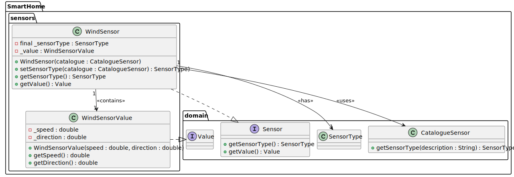

## US21 Create a sunset sensor

## 0. Requirements
_As Product Owner, I want the system to have a type of sensor that gives the sunset instant for a given calendar date._

To create a sunset sensor, the system must have a type of sensor that gives the sunset instant for a given calendar date. The sensor must have a value and a unit. The value will be the sunset precise to the minute and the unit will be the time of the day.
The sensor should work for any future or past date. The granularity of the sensor was discussed with the stakeholders and it was decided no specific granularity was needed.

## 1. Analysis
_For this task, the team has to analyze the best way to implement in order to meet the requirements._

### 1.1. System Sequence Diagram
_If applicable we would create a system sequence diagram to illustrate the interaction between the system and the user._

### 1.2. Use Case description
_We would create a use case description to illustrate the interaction between the system and the user._
_At present this US has a static implementation_

_Example: Generic Use Case - Search for a Product_

    Use Case Name: Retrieve Sunset Time

    Actor: Product Owner (and indirectly other users who benefit from this feature)

    Goal: The product owner wants to provide users with accurate sunset information based on a selected date, enhancing the application's functionality.

    Preconditions:
    The system has access to a reliable source of sunset data (e.g., an astronomy API or a pre-calculated database)
    The system has a method to input calendar dates.
    The system has a method to determine the user's location or has access to the user's location information.

    Trigger: The user selects a date on which they want to know the sunset time.

    Basic Flow:
    The user enters a calendar date using the system's interface.
    The system queries an external source for the sunset time on the specified date. ? we will use the location of the house
    The system retrieves the sunset time in a standard time format precise to minutes
    The system displays the retrieved sunset time to the user in a clear and readable way.

    Alternative Flows:
    Invalid Date: If the user enters an invalid date, the system displays an appropriate error message and prompts the user to re-enter the date.
    Location Determination Failure: If the user's location cannot be determined automatically, the system informs the user.

    Postconditions:
    The user is presented with the correct sunset time for the specified date.
    The user can optionally query for sunset times on other dates.

### 1.3. Dependency of another user story
_If applicable we would describe the dependency of this user story on another user story._
_At present this US has no dependency on another user story_

### 1.4. Relevant domain model aggregates
_If we should describe the relevant domain model for this user story._

### 1.5. Required classes
_If applicable we would describe the required classes for this user story._

_SunsetSensor_
- Attributes:
  - sensorType
  - sunsetTimeValue
  - longitude
  - latitude
- Constructor:
  - SunsetSensor(sensorType, longitude, latitude, sunsetProvider)
- Methods:
  - getSensorType()
  - getSunsetTime()
  - getValue()

_SunsetTimeValue_
- Attributes:
  - LocalTime
- Constructor:
  - SunsetTimeValue(LocalTime)
- Methods:
  - toString() - returns the value as a string

## 2. Design
_The team will design the best way to implement the requirements._
### 2.1. Class Diagram
_We would create a class diagram to illustrate the interaction between the system and the user._

### 2.2. Sequence Diagram
_If applicable we would create a sequence diagram to illustrate the interaction between the system and the user._

### 2.3. Applied Patterns
_If applicable we would describe the patterns applied to this user story._
- Factory Method: The senor is created by a factory method, that is responsible for creating all supported sensor types
- Single Responsibility Principle: The sensor class has a single responsibility, to provide the sunset time for a given date.
- Interface implementation: The sensor class implements the Sensor interface, which is a common interface for all sensors in the system.

## 3. Tests
_The team will design the best way to test the requirements._
### 3.1. Unit Tests

## 4. Implementation

## 5. Demonstration
